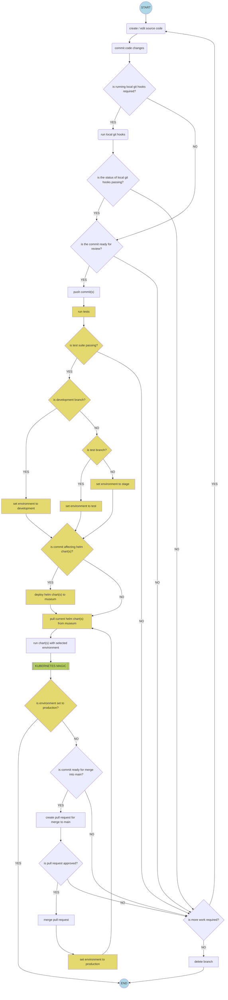

# Kubernetes Flowchart

A flow chart outlining Kubernetes deployment for UCLA Library

```mermaid
flowchart TD
  S((START))
  LC("create / edit source code")
  CC(commit code changes)
  GHE{is running local git hooks required?}
  LGH(run local git hooks)
  PC["push commit(s)"]
  GHP{is the status of local git hooks passing?}
  MR{is the commit ready for review?}
  MWR{is more work required?}
  DBr[delete branch]
  RT[run tests]
  TSP{is test suite passing?}
  DB{is development branch?}
  DE[set enviromnent to development]
  TB{is test branch?}
  TE[set environment to test]
  SE[set environment to stage]
  HC{"is commit affecting helm chart(s)?"}
  PM["deploy helm chart(s) to museum"]
  PH["pull current helm chart(s) from museum"]
  RC["run chart(s) with selected environment"]
  KM[[KUBERNETES MAGIC]]
  MM{is environment set to production?}
  CR{is commit ready for merge into main?}
  PR[create pull request for merge to main]
  PRA{is pull request approved?}
  MPR[merge pull request]
  PE[set environment to production]
  H((END))

  S --> LC
  LC --> CC
  CC --> GHE
  GHE --> |YES| LGH
  GHE --> |NO| MR
  LGH --> GHP
  GHP --> |YES| MR
  GHP --> |NO| MWR
  MR --> |YES| PC
  MR --> |NO| MWR
  MWR --> |YES| LC
  MWR --> |NO| DBr
  DBr --> H
  PC --> RT
  RT --> TSP
  TSP --> |YES| DB
  TSP --> |NO| MWR
  DB --> |YES| DE
  DB --> |NO| TB
  TB --> |YES| TE
  TB --> |NO| SE
  DE --> HC
  TE --> HC
  SE ---> HC
  HC --> |YES| PM
  HC --> |NO| PH
  PM --> PH
  PH --> RC
  RC --> KM
  KM --> MM
  MM --> |YES| H
  MM --> |NO| CR
  CR --> |YES| PR
  CR --> |NO| MWR
  PR --> PRA
  PRA --> |YES| MPR
  MPR --> PE
  PRA --> |NO| MWR
  PE --> PH

  classDef terminator fill:#add8e6;
  classDef github fill:#e4d96f;
  classDef magic fill:#B4CE5F;

  class S,H terminator;
  class KM magic;
  class RT,TSP,DB,DE,TB,TE,SE,HC,PM,PH,MM,PE github;
```
