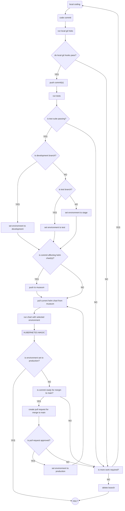

# Kubernetes Flowchart

A flow chart outlining Kubernetes deployment for UCLA Library

- local coding

- code commit

- local git hooks

- do local hooks pass?
  - Y skip to is more work required?
  - N continue

- push commit(s)

- run tests

- is test suite passing?
  - Y continue
  - N skip to is more work required?

- is development branch?
  - Y environment is development
      skip to does commit affect helm charts
  - N continue

- is test branch?
  - Y environment is test
      continue
  - N environment is stage
      continue

- is commit affecting helm charts?
  - Y push to museum
      continue
  - N continue

- pull current chart from museum

- run chart with selected environment

- `[[ KUBERNETES MAGIC ]]`

- is merge to main?
  - Y HALT
  - N continue

- is commit ready for merging to main?
  - Y continue
  - N skip to is more work required?

- create PR for merge to main

- is PR approved?
  - Y environment is production
      skip to pull current chart from museum
  - N continue

- is more work required?
  - Y skip to local coding
  - N delete branch
      HALT
